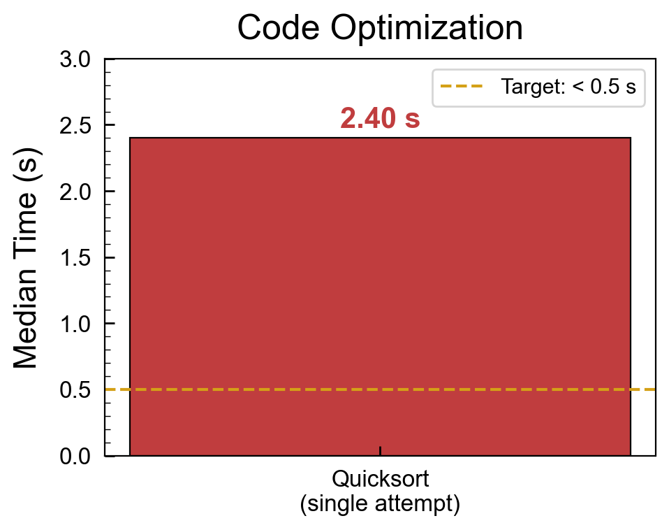
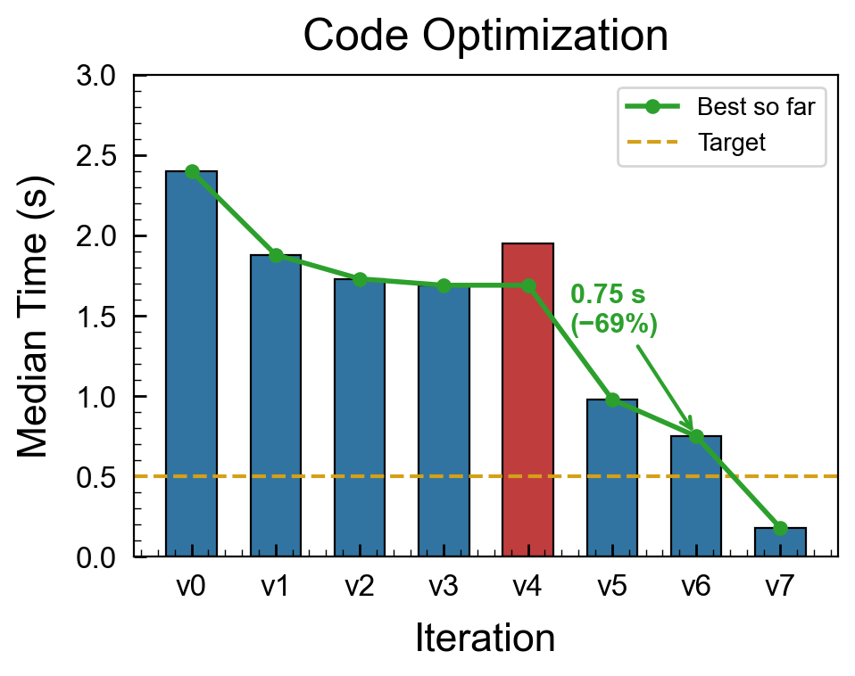
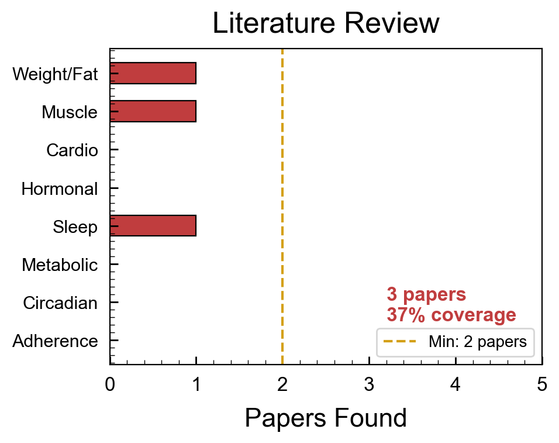
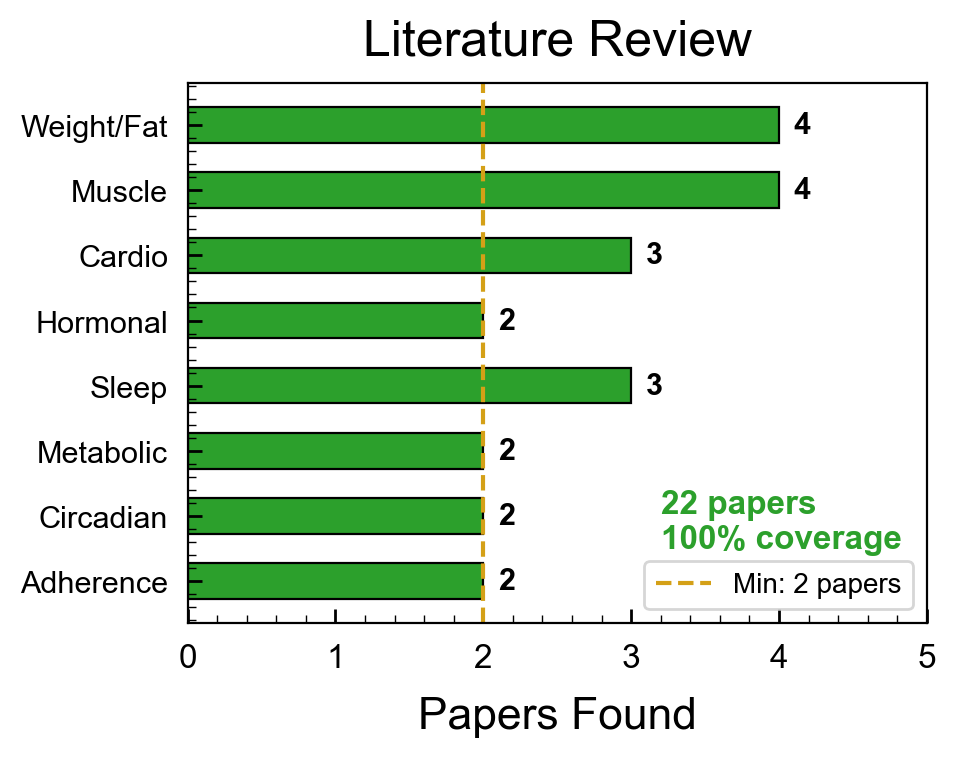
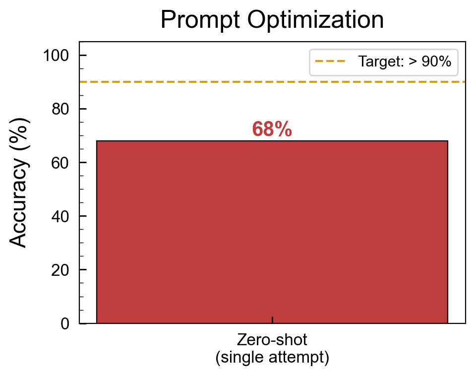
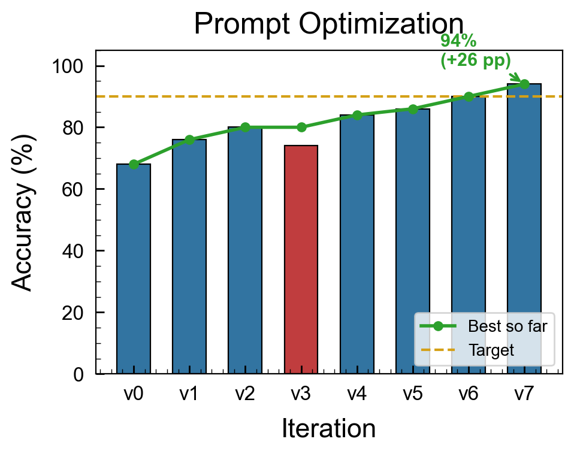
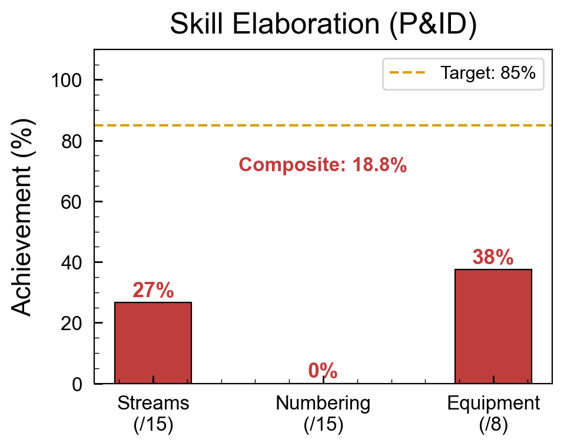
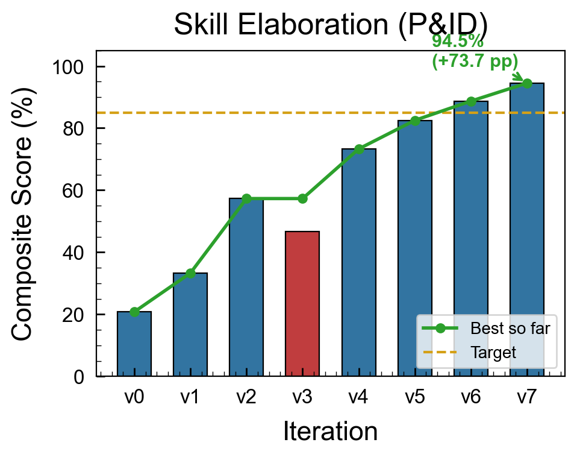

<p align="center"></p>

<h1 align="center">autoresearch-skill</h1>
<p align="center">
  <em>목표를 정의하세요. 에이전트가 자율적으로 연구하고, 실험하고, 반복합니다.</em>
</p>
<p align="center">
  <a href="#빠른-시작">빠른 시작</a> · <a href="#기능">기능</a> · <a href="#사용법">사용법</a> · <a href="./README.md">English</a>
</p>
<p align="center">
  
  
  
  
</p>

---

### autoresearch-skill 적용 전후 비교

| | autoresearch-skill 없이 | autoresearch-skill 적용 |
|:---:|:---:|:---:|
| **코드 최적화** |  |  |
| **문헌 리뷰** |  |  |
| **프롬프트 최적화** |  |  |
| **스킬 정교화** |  |  |

> [!NOTE]
> 자연어 연구 목표를 자율적인 실험-평가-반복 루프로 변환하는 LLM 스킬입니다. [카파시의 autoresearch](https://github.com/karpathy/autoresearch)에서 영감을 받았습니다. `research.md` 파일을 작성하면 에이전트가 가설 생성, 실험 실행, 평가, 반복을 자동으로 처리합니다. Claude Code, Codex CLI, Gemini CLI에서 작동합니다.

## 기능

- **카파시 영감 루프** -- ML 트레이닝을 넘어 일반화된 자율적 실험 -> 평가 -> 유지/복원 사이클
- **자연언어 프로그래밍** -- `research.md`가 프로그램입니다. 목표, 지표, 제약을 일반 텍스트로 정의합니다
- **의존성 없음** -- Python 표준 라이브러리만 사용합니다. 핵심 기능에 pip 패키지 필요 없음
- **멀티 에이전트 호환** -- Claude Code, Codex CLI, Gemini CLI에서 즉시 작동합니다
- **자동 롤백** -- 실패한 실험은 자동으로 복원되고, 개선된 것만 유지됩니다
- **완전한 감사 기록** -- 모든 반복이 `research_log.md`에 타임스탬프, 변경 사항, 결과와 함께 기록됩니다
- **3단계 환경 감지** -- 런타임에 맞게 적응합니다: 완전 실험(Tier 1), 연구 전용(Tier 2), 분석 전용(Tier 3)
- **내장 안전 장치** -- 최대 반복 횟수, 검토 대기 간격, 금지된 변경 경계, 시간 예산

## 왜 이 스킬인가?

다른 autoresearch 구현체는 루프 개념만 제공합니다. 이 레포는 **완전한 툴킷**을 제공합니다:

- **4개 실제 예시** -- 실측 데이터 기반, 템플릿이나 플레이스홀더가 아님
- **시각적 증거** -- 전/후 비교 차트, 최적화 궤적, 에러 히트맵
- **멀티에이전트 호환** -- Claude Code, Codex CLI, Gemini CLI 모두 지원
- **복사-붙여넣기 설치** -- 한 블록을 LLM 채팅에 붙여넣기만 하면 완료
- **스캐폴딩 도구** -- `init_research.py`로 수초 내에 연구 프로젝트 생성
- **핵심 원칙** -- Karpathy 7원칙을 `research.md`에 실용적으로 매핑
- **정체 감지** -- 루프가 정체되면 자동으로 전략 전환
- **엔드게임 전략** -- iteration이 부족하면 탐색에서 활용으로 전환
- **TSV 로깅** -- CI 통합 및 분석을 위한 기계 판독 가능한 `autoresearch-results.tsv`

## 빠른 시작

### 복사-붙여넣기 설치

> [!TIP]
> 스킬을 지원하는 모든 LLM CLI(Claude Code, Codex, Gemini CLI)에서 작동합니다. 아래 블록을 채팅에 붙여넣으세요.

```
I want to install the autoresearch-skill. Do these steps:
1. git clone https://github.com/wjgoarxiv/autoresearch-skill.git /tmp/autoresearch-skill
2. mkdir -p ~/.claude/skills/autoresearch-skill && cp -r /tmp/autoresearch-skill/SKILL.md /tmp/autoresearch-skill/scripts /tmp/autoresearch-skill/assets ~/.claude/skills/autoresearch-skill/
3. Test: python ~/.claude/skills/autoresearch-skill/scripts/init_research.py --goal "test" --metric "score" --direction maximize --output /tmp/test-research && echo "OK: autoresearch-skill installed"
4. Say "autoresearch-skill installed successfully"
```

### 수동 설치

```bash
# 저장소 복제
git clone https://github.com/wjgoarxiv/autoresearch-skill.git
cd autoresearch-skill

# 스킬 디렉토리로 심링크 생성
mkdir -p ~/.claude/skills
ln -s "$(pwd)" ~/.claude/skills/autoresearch-skill

# pip 의존성 필요 없음!
```

### 다른 도구

| 도구            | 스킬 경로                         | 설치 명령어                                                                  |
| --------------- | --------------------------------- | ---------------------------------------------------------------------------- |
| **Claude Code** | `~/.claude/skills/autoresearch-skill/` | 위 참조                                                                      |
| **Codex CLI**   | `~/.codex/skills/autoresearch-skill/`  | `mkdir -p ~/.codex/skills && ln -s "$(pwd)" ~/.codex/skills/autoresearch-skill`   |
| **Gemini CLI**  | `~/.gemini/skills/autoresearch-skill/` | `mkdir -p ~/.gemini/skills && ln -s "$(pwd)" ~/.gemini/skills/autoresearch-skill` |

## 사용법

### 1. 프롬프트 최적화

```
My customer support classifier prompt scores 68% accuracy.
Use auto-research to optimize it above 90% on these 50 test cases.
```

### 2. 문헌 검토

```
Research the latest advances in "LLM agents for scientific discovery".
Find and synthesize at least 15 papers from 2024-2026.
```

### 3. 코드 최적화

```
My sort function takes 2.3s on 1M items. Use auto-research to make it faster.
Target: under 0.5 seconds. Pure Python only, no C extensions.
```

### 4. 설정 튜닝

```
Find the optimal webpack config for my project.
Metric: minimize gzipped bundle size. Constraint: all e2e tests must pass.
```

### 5. 새 연구 프로젝트 스캐폴딩

```bash
python scripts/init_research.py \
  --goal "데이터베이스 쿼리 성능 최적화" \
  --metric "query_time_ms" \
  --direction minimize \
  --target "< 50" \
  --output ./db-research/
```

## 작동 방식

```
┌─────────────────────────────────────────────────────────────┐
│                     research.md                             │
│  (Goal, Metric, Constraints, Search Space, History)         │
└─────────────────────┬───────────────────────────────────────┘
                      │
                      v
            ┌─────────────────┐
            │  1. UNDERSTAND   │  research.md와 기록 읽기
            └────────┬────────┘
                     v
            ┌─────────────────┐
            │  2. HYPOTHESIZE  │  테스트 가능한 변경 제안
            └────────┬────────┘
                     v
            ┌─────────────────┐
            │  3. EXPERIMENT   │  실행: 코드 실행 / 검색 / 분석
            └────────┬────────┘
                     v
            ┌─────────────────┐
         ┌──│  4. EVALUATE     │──┐
         │  └─────────────────┘  │
     개선됨?                    개선 안됨?
         │                       │
    ┌────v────┐            ┌─────v─────┐
    │  유지   │            │  복원     │
    └────┬────┘            └─────┬─────┘
         │                       │
         └──────────┬────────────┘
                    v
            ┌─────────────────┐
            │ 5. LOG & ITERATE │──→ 1단계로 돌아가기
            └─────────────────┘    (또는 완료시 중지)
```

## 출력 형식

스킬은 3개의 파일을 생성합니다:

| 파일              | 용도                                    | 증가 여부            |
| ----------------- | --------------------------------------- | -------------------- |
| `research.md`     | 반복 기록이 있는 생활 중인 연구 문서    | 매 반복마다 업데이트 |
| `research_log.md` | 상세한 추가 전용 실험 로그              | 추가만 가능          |
| `final_report.md` | 최적 결과와 통찰력이 있는 구조화된 요약 | 마지막에 생성        |

## 환경 계층

스킬은 런타임 기능을 자동으로 감지합니다:

| 계층       | 환경                                 | 기능                      | 사용 사례                      |
| ---------- | ------------------------------------ | ------------------------- | ------------------------------ |
| **Tier 1** | Claude Code, Codex CLI, 터미널       | Bash + Python + 전체 도구 | 실험 실행, 벤치마크, 파일 수정 |
| **Tier 2** | 웹 접근이 있는 Claude App            | WebFetch + WebSearch      | 문헌 검토, 웹 연구             |
| **Tier 3** | 제한된 환경 (셸 없음, 네트워크 없음) | 텍스트 생성               | 사용자 데이터 분석, 가설 제안  |

## 요구사항

| 요구사항        | 상세                                                                  |
| --------------- | --------------------------------------------------------------------- |
| **Python**      | 3.8+ (표준 라이브러리만)                                              |
| **LLM CLI**     | Claude Code, Codex CLI, 또는 Gemini CLI                               |
| **도메인 도구** | 사용 사례에 따라 다름 (예: 코드 최적화는 Python, 문헌 검토는 웹 접근) |

## 영감

[카파시의 autoresearch](https://github.com/karpathy/autoresearch) -- AI 에이전트가 밤새 ML 실험을 자율적으로 실행하는 630줄의 프레임워크입니다. 이 스킬은 측정 가능한 목표와 탐색할 검색 공간이 있는 모든 분야로 그 루프를 일반화합니다.

## 기여

기여를 환영합니다! 새로운 예제 `research.md` 템플릿에 대한 아이디어가 특히 감사합니다.

1. 저장소를 포크합니다
2. 기능 분기를 생성합니다 (`git checkout -b feature/amazing-example`)
3. 변경사항을 커밋합니다 (`git commit -m 'Add amazing example'`)
4. 분기로 푸시합니다 (`git push origin feature/amazing-example`)
5. Pull Request를 엽니다

## 라이선스

MIT -- 자세한 내용은 [LICENSE](./LICENSE)를 참조하세요.
