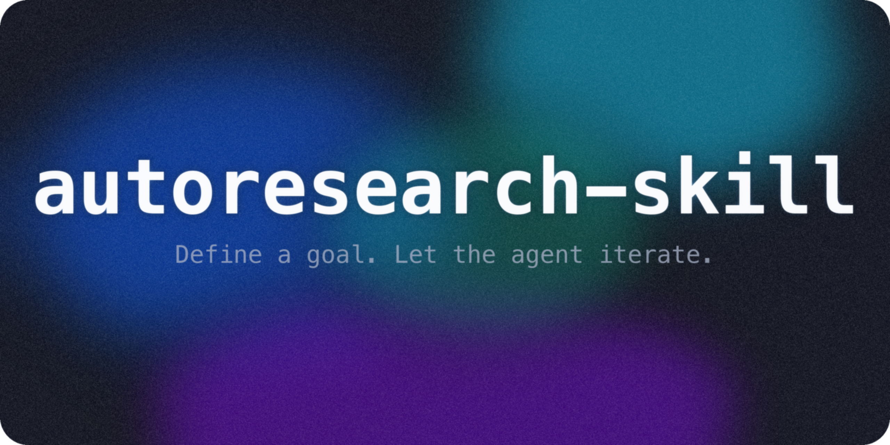

<p align="center"></p>

<h1 align="center">autoresearch-skill</h1>
<p align="center">
  <em>Define a goal. Let the agent research, experiment, and iterate -- autonomously.</em>
</p>
<p align="center">
  <a href="#when-to-use">When to Use</a> · <a href="#quick-start">Quick Start</a> · <a href="#features">Features</a> · <a href="#usage">Usage</a> · <a href="./README-Ko-KR.md">한국어</a>
</p>
<p align="center">
  
  
  
  
  
  
  
  
</p>

---

### autoresearch-skill in Action

| | Example | Result | Iterations | Evaluator |
|:---:|:---|:---|:---:|:---:|
| 1 | **Code Optimization** — Sort 1M integers faster | 2.12s → 0.15s (−93%) | 8 | `benchmark.py` |
| 2 | **Function Fitting** — Discover hidden math function | RMSE 2.11 → 0.030 (−99%) | 8 | `evaluate.py` |
| 3 | **Skill Elaboration** — Improve P&ID analysis skill | 0.28 → 0.98 composite (+255%) | 2 | `evaluate.py` |
| 4 | **Literature Review** — Exercise timing papers | 1/8 → 8/8 categories, 19 papers | 4 | Agent (Tier 2) |

> [!NOTE]
> An LLM skill that turns natural-language research goals into autonomous experiment-evaluate-iterate loops -- inspired by [Karpathy's autoresearch](https://github.com/karpathy/autoresearch). Write a `research.md`, and the agent handles hypothesis generation, experimentation, evaluation, and iteration. Works with Claude Code, Codex CLI, OpenCode, and Gemini CLI.

## Expected Outputs: Visual Result Gallery

Each run leaves behind human-readable reports, machine-readable logs, and visual evidence. These examples are checked into the repo so you can see the shape of a completed autoresearch loop before running your own.

| Example | Goal | Metric | Before → After | Iterations | Visual preview | Artifacts |
|---|---|---:|---:|---:|---|---|
| [Code Optimization](./examples/code-optimization/README.md) | Sort 1M integers faster | median runtime ↓ | 2.12s → 0.15s | 8 | [results.png](./examples/code-optimization/results.png) | `research.md`, `autoresearch-results.tsv`, `final_report.md` |
| [Function Fitting](./examples/function-fitting/README.md) | Recover an unknown function from data | RMSE ↓ | 2.11 → 0.030 | 8 | [results.png](./examples/function-fitting/results.png) | `train_data.csv`, `test_data.csv`, `evaluate.py`, `final_report.md` |
| [Skill Elaboration](./examples/skill-elaboration/README.md) | Improve a PDF/P&ID analysis skill | structural score ↑ | 0.28 → 0.98 | 2 | [results.png](./examples/skill-elaboration/results.png) | original/improved `SKILL.md`, `evaluate.py`, `final_report.md` |
| [Literature Review](./examples/literature-review/README.md) | Fill exercise-timing literature coverage gaps | categories covered ↑ | 1/8 → 8/8 | 4 | [results.png](./examples/literature-review/results.png) | `research_log.md`, `autoresearch-results.tsv`, `final_report.md` |

Typical final directory shape:

```text
my-research/
├── research.md                 # living state + iteration history
├── research_log.md             # append-only reasoning and evidence log
├── autoresearch-results.tsv    # machine-readable metric table
├── progress.png                # convergence plot refreshed during runs
└── final_report.md             # final result, failures, and next steps
```

## Features

- **Karpathy-Inspired Loop** -- Autonomous experiment -> evaluate -> keep/revert cycle, generalized beyond ML training
- **Natural Language Programming** -- `research.md` is your program: define goals, metrics, and constraints in plain English
- **Zero Dependencies** -- Python stdlib only. No pip packages required for core functionality
- **Multi-Agent Compatible** -- Works with Claude Code, Codex CLI, OpenCode, and Gemini CLI out of the box
- **Automatic Rollback** -- Failed experiments are reverted automatically; only improvements are kept
- **Full Audit Trail** -- Every iteration logged to `research_log.md` with timestamps, changes, and results
- **3 Tier Environment Detection** -- Adapts to your runtime: full experimentation (Tier 1), research-only (Tier 2), or analysis-only (Tier 3)
- **Safety Built In** -- Max iterations, pause-for-review intervals, forbidden-change boundaries, and time budgets

## Command Inventory

| Command | Purpose |
|---------|---------|
| `/autoresearch` | Core 5-stage loop — understand, hypothesize, experiment, evaluate, log & iterate |
| `/autoresearch:plan` | 7-step setup wizard that produces a ready-to-run `research.md` |
| `/autoresearch:debug` | Scientific bug hunting with falsifiable hypotheses and evidence tables |
| `/autoresearch:fix` | Iterative error crusher — runs until error count reaches zero |
| `/autoresearch:predict` | Multi-persona deliberation with anti-herd-bias detection |
| `/autoresearch:security` | STRIDE + OWASP iterative security audit |
| `/autoresearch:scenario` | 12-dimension scenario exploration for decision analysis |
| `/autoresearch:reason` | Adversarial refinement with blind-judge scoring panel |
| `/autoresearch:ship` | Universal shipping workflow supporting 9 ship types |
| `/autoresearch:learn` | Feedback-to-eval loop for improving the skill itself |

## Quick Decision Guide

**What do you want to do?**

| Goal | Use |
|------|-----|
| Optimize something iteratively toward a numeric target | `/autoresearch` |
| Set up a new research project from scratch | `/autoresearch:plan` |
| Hunt down a hard-to-reproduce bug | `/autoresearch:debug` |
| Crush all errors in a codebase to zero | `/autoresearch:fix` |
| Forecast outcomes or predict what will happen | `/autoresearch:predict` |
| Audit a system for security vulnerabilities | `/autoresearch:security` |
| Explore "what if" scenarios before committing to a path | `/autoresearch:scenario` |
| Think through a complex decision rigorously | `/autoresearch:reason` |
| Release a feature, library, or artifact | `/autoresearch:ship` |
| Turn a failed/confusing skill run into an improvement plan | `/autoresearch:learn` |

## Why This Skill?

Other autoresearch implementations provide the loop concept. This repo provides the **complete toolkit**:

- **4 worked examples** with real measured data -- not templates, not placeholders
- **Visual evidence** -- before/after charts, optimization trajectories, error heatmaps
- **Multi-agent compatible** -- works with Claude Code, Codex CLI, OpenCode, and Gemini CLI
- **Copy-paste install** -- one block, paste into your LLM chat, done
- **Scaffolding tool** -- `init_research.py` creates a ready-to-run research project in seconds
- **Core principles** -- 8 formalized Karpathy principles with practical mapping to `research.md`
- **Stuck detection** -- automatic strategy shifts when the loop plateaus
- **Endgame strategy** -- switches from explore to exploit when iterations are running out
- **TSV logging** -- machine-readable `autoresearch-results.tsv` for CI integration and analysis

## When to Use

Most LLM CLI tools already ship with iterative execution modes -- `ralph`, `autopilot`, `/loop`, cron-based scheduling, etc. Those work well for code-centric tasks tied to git, test runners, and build systems. autoresearch-skill targets a different problem shape: **anything with a numeric metric and a search space to explore**, whether or not it involves code.

### autoresearch-skill vs built-in iterative modes

|  | Manual prompting | Built-in modes (ralph, autopilot, team) | autoresearch-skill |
|:---|:---|:---|:---|
| **Domain** | Anything, but you drive each cycle | Code projects (git + tests + build) | Any domain with a measurable metric |
| **Evaluation** | LLM self-reports results | Acceptance criteria, often subjective | Mechanical evaluator: `{"pass": true, "score": 0.94}` |
| **On plateau** | You decide what to try next | Retry or terminate | 3-level pivot -- switch strategy, then paradigm, then finalize |
| **Autonomy** | One cycle per human turn | High, but verification gates can pause | Uses full iteration budget without asking |
| **Overnight runs** | Not practical | Platform-specific (`/loop`, `CronCreate`) | Cross-platform bash script (Claude Code, Codex, Gemini CLI) |
| **Environment** | Depends on tool | Assumes shell access | 3-tier auto-detection (shell / web-only / text-only) |
| **Dependencies** | Varies | git, pytest, etc. | Python 3.8+ stdlib only |

### Pick autoresearch-skill when

- You have a **numeric metric** and a script that outputs `{"pass": bool, "score": number}` -- the mechanical evaluator removes LLM judgment from keep/revert decisions
- The problem is **not a code project** -- simulation parameter sweeps, literature coverage gaps, prompt tuning against test cases, function fitting from data
- You need **overnight runs across CLI platforms**, not just Claude Code
- Progress will **plateau**, and you want the agent to pivot strategy instead of stopping
- You want a **machine-readable audit trail** (TSV + append-only log) of every iteration

### Stick with built-in modes when

- The task is **bug fixes or feature implementation** -- ralph and autopilot understand PRDs, acceptance criteria, and code review workflows
- Multiple agents need to **work on different subtasks in parallel** -- that's what team mode does
- There is **no measurable metric** -- autoresearch needs a target to iterate toward
- **One attempt is enough** -- no iteration loop needed

## Quick Start

### Copy-Paste Install

> [!TIP]
> Works with any LLM CLI that supports skills (Claude Code, Codex, Gemini CLI). Just paste the block below into your chat.

```
I want to install the autoresearch-skill. Do these steps:
1. git clone https://github.com/wjgoarxiv/autoresearch-skill.git /tmp/autoresearch-skill
2. mkdir -p ~/.claude/skills/autoresearch-skill && cp -r /tmp/autoresearch-skill/SKILL.md /tmp/autoresearch-skill/scripts /tmp/autoresearch-skill/assets ~/.claude/skills/autoresearch-skill/
3. Test: python ~/.claude/skills/autoresearch-skill/scripts/init_research.py --goal "test" --metric "score" --direction maximize --output /tmp/test-research && echo "OK: autoresearch-skill installed"
4. Say "autoresearch-skill installed successfully"
```

### Plugin Marketplace Install

If your LLM CLI supports a plugin marketplace (`.claude-plugin/` discovery), paste this single block into your chat:

```
Install the autoresearch-skill plugin:
1. git clone https://github.com/wjgoarxiv/autoresearch-skill.git /tmp/autoresearch-skill
2. mkdir -p ~/.claude/plugins && cp -r /tmp/autoresearch-skill/.claude-plugin ~/.claude/plugins/autoresearch-skill
3. Reload plugins and confirm: "autoresearch-skill plugin installed"
```

### Manual Install

```bash
# Clone the repo
git clone https://github.com/wjgoarxiv/autoresearch-skill.git
cd autoresearch-skill

# Symlink into your skills directory
mkdir -p ~/.claude/skills
ln -s "$(pwd)" ~/.claude/skills/autoresearch-skill

# No pip dependencies needed!
```

### Other Tools

| Tool | Skills Path | Install Command |
|------|-------------|-----------------|
| **Claude Code** | `~/.claude/skills/autoresearch-skill/` | See above |
| **Codex CLI** | `~/.codex/skills/autoresearch-skill/` | `mkdir -p ~/.codex/skills && ln -s "$(pwd)" ~/.codex/skills/autoresearch-skill` |
| **OpenCode** | `~/.config/opencode/skills/autoresearch-skill/` | `mkdir -p ~/.config/opencode/skills && ln -s "$(pwd)" ~/.config/opencode/skills/autoresearch-skill` |
| **Gemini CLI** | `~/.gemini/skills/autoresearch-skill/` | `mkdir -p ~/.gemini/skills && ln -s "$(pwd)" ~/.gemini/skills/autoresearch-skill` |

## Installation

Copy this skill into your CLI tool's skills directory:

| Platform | Command |
|----------|---------|
| **Claude Code** | `cp -r autoresearch-skill/ ~/.claude/skills/autoresearch-skill/` |
| **Codex CLI** | `cp -r autoresearch-skill/ ~/.codex/skills/autoresearch-skill/` |
| **OpenCode** | `cp -r autoresearch-skill/ ~/.config/opencode/skills/autoresearch-skill/` |
| **Gemini CLI** | `cp -r autoresearch-skill/ ~/.gemini/skills/autoresearch-skill/` |

Or clone directly:
```bash
git clone https://github.com/wjgoarxiv/autoresearch-skill.git
cp -r autoresearch-skill/ ~/.claude/skills/   # adjust path for your platform
```

The skill is automatically discovered when you mention "autoresearch" or "research.md" in your prompt.

## Usage

### 1. Literature Review

```
Research the latest advances in "LLM agents for scientific discovery".
Find and synthesize at least 15 papers from 2024-2026.
```

### 2. Code Optimization

```
My sort function takes 2.3s on 1M items. Use auto-research to make it faster.
Target: under 0.5 seconds. Pure Python only, no C extensions.
```

### 3. Function Fitting

```
I have data points from an unknown function in train_data.csv.
Use autoresearch to discover the function. Minimize RMSE below 0.05.
Here's my evaluate.py that outputs {"pass": true, "score": -0.034}.
```

### 4. Scaffold a New Research Project

```bash
python scripts/init_research.py \
  --goal "Optimize database query performance" \
  --metric "query_time_ms" \
  --direction minimize \
  --target "< 50" \
  --output ./db-research/
```

## Overnight Runs

To run autoresearch overnight (or for days), use the universal loop script:

```bash
# 1. Set up your research project
python scripts/init_research.py --goal "..." --metric "..." --direction maximize --output ./my-research/

# 2. Start the overnight loop (pick one)

# Option A: Keep terminal open (simplest)
bash scripts/autoresearch-loop.sh ./my-research/

# Option B: Background without tmux
nohup bash scripts/autoresearch-loop.sh ./my-research/ > autoresearch.log 2>&1 &

# Option C: Background with tmux (best experience)
tmux new-session -d -s research 'bash scripts/autoresearch-loop.sh ./my-research/'

# 3. Check progress anytime
bash scripts/check_progress.sh ./my-research/
```

The script auto-detects your CLI tool and handles session restarts, completion detection, and safety limits. Works with Claude Code, Codex CLI, OpenCode, and Gemini CLI. No dependencies beyond bash.

## How It Works

```
┌─────────────────────────────────────────────────────────────┐
│                     research.md                             │
│  (Goal, Metric, Constraints, Search Space, History)         │
└─────────────────────┬───────────────────────────────────────┘
                      │
                      v
            ┌─────────────────┐
            │  1. UNDERSTAND   │  Read research.md + history
            └────────┬────────┘
                     v
            ┌─────────────────┐
            │  2. HYPOTHESIZE  │  Propose a testable change
            └────────┬────────┘
                     v
            ┌─────────────────┐
            │  3. EXPERIMENT   │  Execute: run code / search / analyze
            └────────┬────────┘
                     v
            ┌─────────────────┐
         ┌──│  4. EVALUATE     │──┐
         │  └─────────────────┘  │
     improved?                not improved?
         │                       │
    ┌────v────┐            ┌─────v─────┐
    │  KEEP   │            │  REVERT   │
    └────┬────┘            └─────┬─────┘
         │                       │
         └──────────┬────────────┘
                    v
            ┌─────────────────┐
            │ 5. LOG & ITERATE │──→ Back to step 1
            └─────────────────┘    (or STOP if done)
```

## Output Format

The skill produces a small, predictable artifact bundle:

| File | Purpose | Updated |
|------|---------|---------|
| `research.md` | Living research document with goal, constraints, search space, and history | Every iteration |
| `research_log.md` | Detailed append-only experiment log: hypothesis, command output, evaluator result, keep/revert decision | Every iteration |
| `autoresearch-results.tsv` | Machine-readable 8-column metric table for plotting, CI, and later analysis | Every iteration |
| `progress.png` | Lightweight convergence plot showing metric trajectory and best-so-far envelope | Every iteration when plotting is available |
| `results.png` / `results.pdf` | Example-specific final visualization, if the run produces one | End of run |
| `final_report.md` | Structured summary with best result, failed attempts, reproducibility commands, and next steps | End only |

## Environment Tiers

The skill automatically detects your runtime capabilities:

| Tier | Environment | Capabilities | Use Case |
|------|-------------|--------------|----------|
| **Tier 1** | Claude Code, Codex CLI, terminal | Bash + Python + full tools | Run experiments, benchmark, modify files |
| **Tier 2** | Claude App with web access | WebFetch + WebSearch | Literature review, web research |
| **Tier 3** | Restricted (no shell, no network) | Text generation | Analyze user data, propose hypotheses |

## Requirements

| Requirement | Details |
|-------------|---------|
| **Python** | 3.8+ (stdlib only) |
| **LLM CLI** | Claude Code, Codex CLI, OpenCode, or Gemini CLI |
| **Domain tools** | Varies by use case (e.g., Python for code optimization, web access for lit review) |

## Inspired By

[Karpathy's autoresearch](https://github.com/karpathy/autoresearch) -- a 630-line framework where an AI agent autonomously runs ML experiments overnight. This skill generalizes that loop to any domain where you have a measurable goal and a search space to explore.

## Contributing

Contributions welcome! Ideas for new example `research.md` templates are especially appreciated.

1. Fork the repo
2. Create your feature branch (`git checkout -b feature/amazing-example`)
3. Commit your changes (`git commit -m 'Add amazing example'`)
4. Push to the branch (`git push origin feature/amazing-example`)
5. Open a Pull Request

## License

MIT -- see [LICENSE](./LICENSE) for details.
