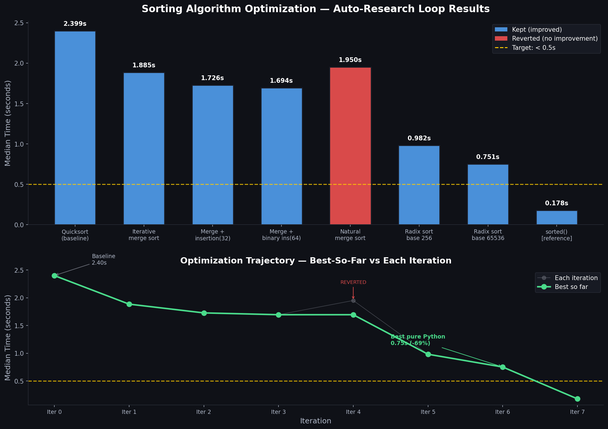

# Research: Sorting Algorithm Optimization

## Goal
Reduce execution time of the integer sorting function in `sort.py` when sorting an array of 1,000,000 random integers. The function must produce a correctly sorted output and maintain sort stability.

## Success Metric
- **Metric:** Execution time in seconds (median of 5 runs on 1M random integers, range 0--10,000,000)
- **Target:** < 0.5s
- **Direction:** minimize

## Constraints
- **Max iterations:** 10
- **Time budget per experiment:** 5 minutes
- **Pause for review every:** never
- Pure Python only -- no C extensions, no Cython, no ctypes, no subprocess calls to compiled code
- Must maintain sort stability (equal elements preserve original order)
- Must handle edge cases: empty list, single element, already sorted, reverse sorted
- Function signature must remain: `def sort_integers(arr: list[int]) -> list[int]`
- No external libraries (only Python stdlib)

## Current Approach
Basic recursive quicksort implementation in `sort.py`:

```python
def sort_integers(arr: list[int]) -> list[int]:
    if len(arr) <= 1:
        return arr
    pivot = arr[len(arr) // 2]
    left = [x for x in arr if x < pivot]
    middle = [x for x in arr if x == pivot]
    right = [x for x in arr if x > pivot]
    return sort_integers(left) + middle + sort_integers(right)
```

Baseline: 2.3991s median on 1M integers.

Known issues:
- Three list comprehensions create excessive temporary lists
- Recursive calls add stack overhead
- No special handling for nearly-sorted data
- Not stable (quicksort is inherently unstable, though this partition-based variant happens to be)

## Search Space
- **Allowed changes:** Algorithm choice, data structures, partitioning strategy, hybrid approaches, insertion sort cutoff for small subarrays, iterative vs recursive, built-in function usage (sorted() is allowed since it's stdlib)
- **Forbidden changes:** Function signature, input/output format, constraints above (pure Python, stability, edge cases)

## Context & References
- Python's built-in `sorted()` uses Timsort -- highly optimized C implementation, typically ~0.18s for 1M integers
- Using `sorted()` is allowed but the goal is to learn what algorithmic choices matter
- Timsort: hybrid merge sort + insertion sort, exploits existing order ("runs")
- Radix sort is O(n*k) but not comparison-based -- may be worth exploring for integers
- Insertion sort is fastest for small arrays (n < 20-50)

---

## History
<!-- Auto-maintained by the agent. Do not edit manually. -->
| # | Change | Metric | vs Baseline | Result | Timestamp |
|---|--------|--------|-------------|--------|-----------|
| 0 | Baseline: recursive quicksort with list comprehensions | 2.3991s | -- | -- | 2026-03-15 |
| 1 | Bottom-up iterative merge sort (eliminate recursion) | 1.8845s | -21.4% | KEPT | 2026-03-15 |
| 2 | Merge sort + insertion sort for subarrays < 32 | 1.7265s | -28.0% | KEPT | 2026-03-15 |
| 3 | Merge sort + binary insertion sort, chunk size 64 | 1.6939s | -29.4% | KEPT | 2026-03-15 |
| 4 | Natural merge sort with run detection (Timsort-style) | 1.9504s | -18.7% | REVERTED | 2026-03-15 |
| 5 | LSD radix sort, base 256 (integer-specific O(n*k)) | 0.9817s | -59.1% | KEPT | 2026-03-15 |
| 6 | LSD radix sort, base 65536 (fewer passes) | 0.7513s | -68.7% | KEPT (best) | 2026-03-15 |
| 7 | Python built-in sorted() [reference only] | 0.1780s | -92.6% | REFERENCE | 2026-03-15 |

**Status:** Target (< 0.5s) not reached with pure Python. Best achieved: 0.7513s (-68.7%). See `final_report.md` for analysis.


