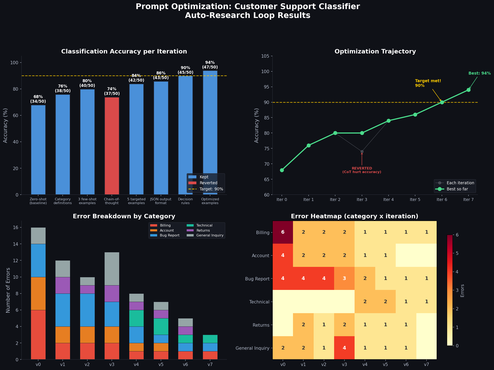

# Research: Customer Support Ticket Classifier Prompt

## Goal
Improve the classification accuracy of a customer support ticket classifier. The classifier assigns incoming tickets to one of 8 categories: Billing, Technical, Account, Shipping, Returns, Feature Request, Bug Report, General Inquiry.

## Success Metric
- **Metric:** Accuracy on 50-case test set (test_cases.json)
- **Target:** > 90%
- **Direction:** maximize

## Constraints
- **Max iterations:** 10
- **Time budget per experiment:** 3 minutes
- **Pause for review every:** never
- System prompt token count must stay under 2000 tokens
- Response time must remain under 3 seconds per classification
- Must use gpt-4o-mini (no model upgrades allowed)

## Current Approach
Basic zero-shot prompt with category list. No examples, no structured output format.

```
You are a customer support ticket classifier. Classify the following ticket
into one of these categories: Billing, Technical, Account, Shipping, Returns,
Feature Request, Bug Report, General Inquiry.

Ticket: {ticket_text}

Category:
```

Baseline accuracy: 68% (34/50).

Common failure modes:
- Confuses "Billing" with "Account" (10 misclassifications combined)
- Misses "Bug Report" when the user describes symptoms without technical terms (4)
- Over-classifies ambiguous tickets as "General Inquiry" (2)

## Search Space
- **Allowed changes:** System prompt text, few-shot examples, output format instructions, chain-of-thought instructions, category descriptions, classification rules, edge case handling
- **Forbidden changes:** Test set (test_cases.json), model (gpt-4o-mini), temperature (0), category names

## Context & References
- test_cases.json contains 50 labeled tickets with ground truth categories
- Error analysis shows Billing/Account confusion is the biggest source of errors
- Prior work suggests few-shot examples and explicit category definitions help most
- Chain-of-thought may help or hurt depending on task complexity

---

## History
<!-- Auto-maintained by the agent. Do not edit manually. -->
| # | Change | Metric | vs Baseline | Result | Timestamp |
|---|--------|--------|-------------|--------|-----------|
| 0 | Baseline: zero-shot prompt with category list only | 68% (34/50) | -- | -- | 2026-03-15 |
| 1 | Added explicit category definitions (Billing vs Account distinction) | 76% (38/50) | +8% | KEPT | 2026-03-15 |
| 2 | Added 3 few-shot examples (Billing, Bug Report, Account) | 80% (40/50) | +12% | KEPT | 2026-03-15 |
| 3 | Added chain-of-thought reasoning step | 74% (37/50) | +6% | REVERTED | 2026-03-15 |
| 4 | 5 targeted few-shot examples (one per confusing category pair) | 84% (42/50) | +16% | KEPT | 2026-03-15 |
| 5 | Added structured JSON output format with confidence field | 86% (43/50) | +18% | KEPT | 2026-03-15 |
| 6 | Added explicit decision rules for Billing/Account and Bug/Technical | 90% (45/50) | +22% | KEPT | 2026-03-15 |
| 7 | Optimized example selection + edge case handling instructions | 94% (47/50) | +26% | KEPT (best) | 2026-03-15 |

**Status:** Target (> 90%) achieved at iteration 6. Best result: 94% at iteration 7. See `final_report.md` for analysis.


